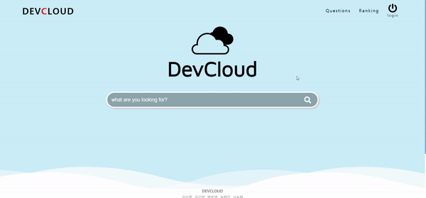
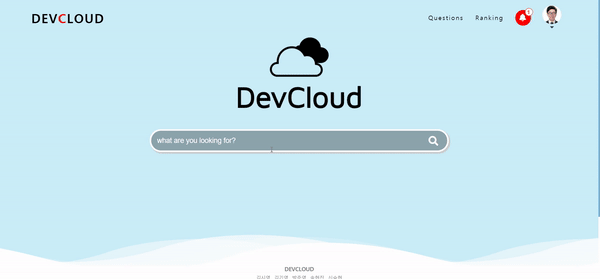
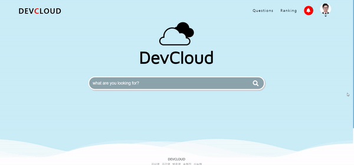
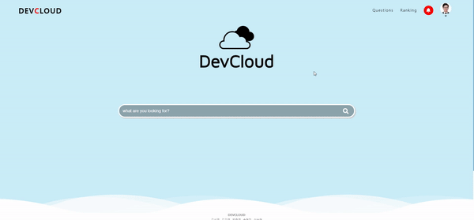
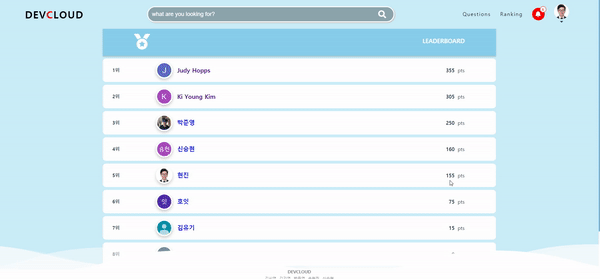
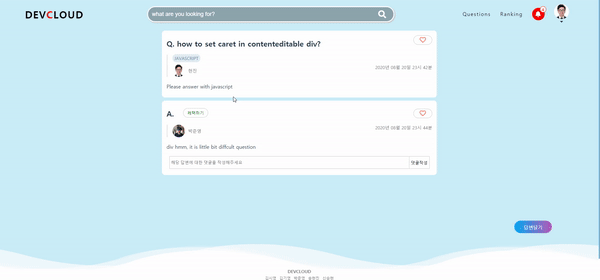

# ☁️DevCloud

> [DevCloud](https://i3c202.p.ssafy.io)

## 📚 목차

- [타겟 사용자](#타겟-사용자)
- [주요 기능](#주요-기능)
- [서버 환경 세팅](#서버-환경-세팅)
- [라이선스](#라이선스)


## 💡 타겟 사용자

- 한국어 답변이 필요한 개발자
- 검색으로 알게 된 정보를 정리하기 귀찮은 개발자


## 🔎 주요 기능

> DevCloud는 개발을 하면서 생기는 궁금증을 해결하기 위해 만들어진 사이트입니다.

1. 별도의 회원가입 없이 구글 로그인으로 사이트를 이용하세요.

   

2. 키워드, 태그로 원하는 내용을 검색해보세요.

   

3. 내 질문, 답변에 대한 실시간 알림을 받아보세요.

   

4. 프로필 페이지에서 내 질문, 답변을 한 눈에 확인하세요.

   

5. 다른 사람의 질문에 답하고 점수를 획득하세요.

   

6. 내 질문에 대한 답을 채택하세요.

   


## ⚙️ 서버 환경 세팅

### 백엔드 서버(Spring-boot)

+ **Setting up the docker**
    ```bash
    > docker run --name maria-db -p 3306:3306 -e MYSQL_ROOT_PASSWORD=<YOUR_DB_PASSWORD> -d mariadb
    > docker exec -it maria-db mysql -u root -p
    ```

+ **Create Maria-DB database**
  
    ```bash
    maria-db> create database ssafydb
    ```
```
    
+ **Configure database**
    ```yml
    # backend/src/main/resources/application.yml
    spring:
        datasource:
            url: jdbc:mysql://localhost:3306/spring_social?useSSL=false
            username: <YOUR_DB_USERNAME>
            password: <YOUR_DB_PASSWORD>
```

+ **Specify OAuth2 Provider ClientId and ClientSecrets**
	```yml
    security:
      oauth2:
        client:
          registration:
            google:
              clientId: <GOOGLE_CLIENT_ID>
              clientSecret: <GOOGLE_CLIENT_SECRET>
              redirectUriTemplate: "{baseUrl}/oauth2/callback/{registrationId}"
              scope:
                - email
                - profile
	```

+ **Run backend server**
	```bash
	> mvn spring-boot:run
	```

### 프론트엔드 서버(Vue.js)

```bash
cd frontend
npm install
npm run serve
```


## ⚖️ 라이선스

### Spring Boot

Apache 2.0 license.

### Vue.js

MIT
Copyright (c) 2013-present, Yuxi (Evan) You

### MariaDB

GNU GPL 2 license.

### Docker5

Apache 2.0 license.